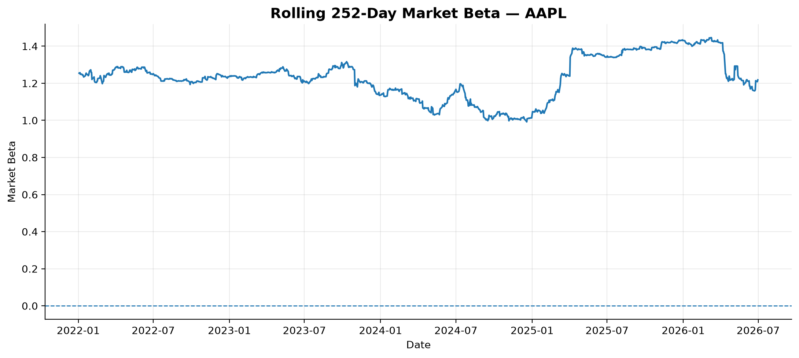
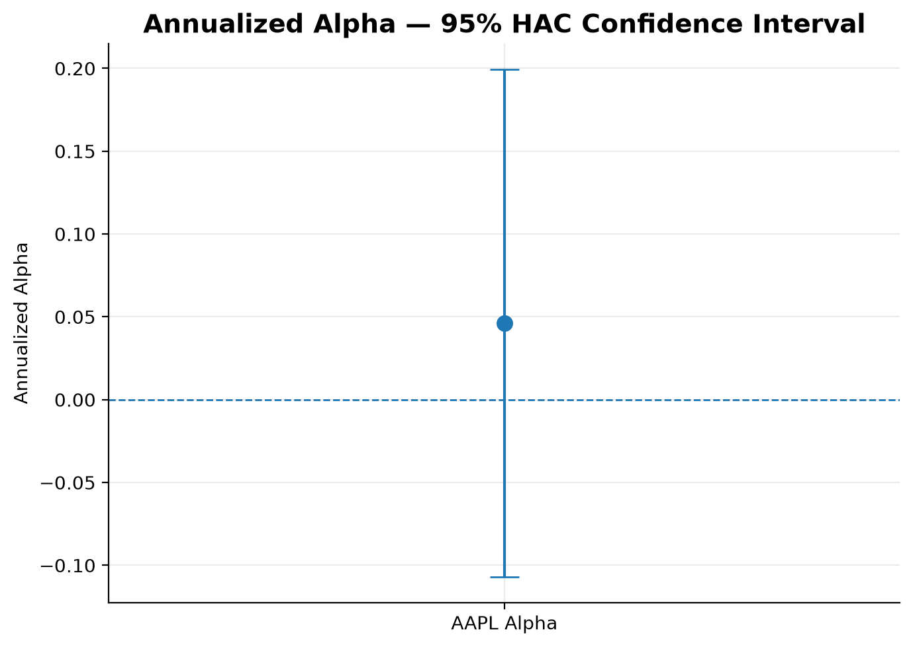
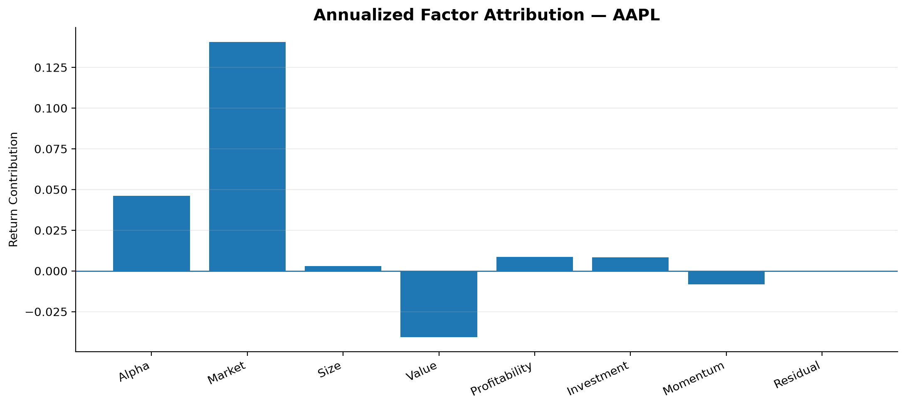
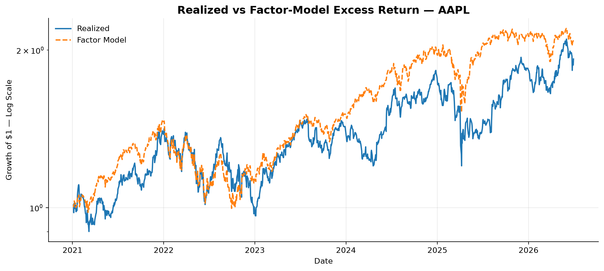

# Fama-French Factor Exposure & Alpha Attribution Engine

A Python-based quantitative research project that decomposes stock returns into systematic factor exposures and evaluates whether factor-adjusted alpha remains after controlling for market, size, value, profitability, investment, and momentum factors.

## Overview

This project implements a Fama-French 5-factor plus Momentum asset-pricing model using daily financial data.

The pipeline estimates:

- Market exposure
- Size exposure
- Value exposure
- Profitability exposure
- Investment exposure
- Momentum exposure
- Factor-adjusted alpha
- Rolling factor exposures
- Multicollinearity diagnostics
- Factor attribution
- Investment performance metrics

## Research Question

**How much of AAPL's historical performance can be explained by systematic factor exposure, and is there evidence of persistent alpha after controlling for those factors?**

## Model

The project estimates:

`Excess Return = Alpha + Market + Size + Value + Profitability + Investment + Momentum + Error`

More specifically:

`R(i,t) - R(f,t) = alpha + beta_M(MKT-RF) + beta_S(SMB) + beta_H(HML) + beta_R(RMW) + beta_C(CMA) + beta_MOM(MOM) + epsilon(t)`

### Factors

| Factor | Description |
|---|---|
| MKT-RF | Market excess return |
| SMB | Size factor |
| HML | Value factor |
| RMW | Profitability factor |
| CMA | Investment factor |
| MOM | Momentum factor |
| RF | Risk-free rate |
| Alpha | Factor-adjusted intercept |

## Data Sources

### Kenneth R. French Data Library

- Daily Fama-French 5 Factors
- Daily Momentum Factor

### Yahoo Finance

- Daily adjusted historical prices for AAPL

The completed AAPL analysis uses the overlapping period from **January 5, 2021 to June 30, 2026**, with **1,377 usable daily observations**.

## Technology Stack

- Python
- Pandas
- NumPy
- Statsmodels
- Matplotlib
- yfinance
- Requests

## Methodology

1. Download daily Fama-French 5-factor data.
2. Download daily momentum data.
3. Download AAPL adjusted historical prices.
4. Calculate daily stock returns.
5. Align stock returns with factor observations.
6. Construct daily excess returns.
7. Estimate the six-factor OLS regression.
8. Use HAC/Newey-West robust standard errors.
9. Calculate VIF multicollinearity diagnostics.
10. Estimate 252-day rolling factor exposures.
11. Calculate factor-return attribution.
12. Calculate investment performance metrics.
13. Generate research visualizations.
14. Export research outputs.

## Results

### Performance

| Metric | Result |
|---|---:|
| CAGR | 16.48% |
| Annualized Volatility | 27.69% |
| Sharpe Ratio | 0.570 |
| Maximum Drawdown | -33.36% |
| Observations | 1,377 |

### Factor Exposures

| Factor | Beta | t-stat | p-value |
|---|---:|---:|---:|
| Market (MKT-RF) | 1.2121 | 29.22 | <0.001 |
| Size (SMB) | -0.1086 | -2.11 | 0.0348 |
| Value (HML) | -0.4760 | -6.58 | <0.001 |
| Profitability (RMW) | 0.4737 | 7.61 | <0.001 |
| Investment (CMA) | 0.4281 | 3.86 | 0.0001 |
| Momentum (MOM) | -0.0941 | -2.76 | 0.0059 |

### Interpretation

The estimated model indicates that AAPL historically exhibited:

- Strong positive market exposure
- Slight negative size exposure
- Strong negative value exposure
- Positive profitability exposure
- Positive investment exposure
- Slight negative momentum exposure

All six factor coefficients were statistically significant at the 5% level in this sample.

## Alpha Analysis

Estimated annualized alpha:

**4.62%**

However:

| Statistic | Value |
|---|---:|
| Alpha t-stat | 0.590 |
| Alpha p-value | 0.555 |

The estimated alpha is therefore **not statistically significant**.

The analysis does not provide strong statistical evidence that AAPL generated persistent abnormal returns after controlling for the six systematic factors.

This highlights an important distinction in quantitative investing:

**Strong historical returns do not automatically imply persistent alpha.**

## Model Fit

| Metric | Result |
|---|---:|
| R-squared | 59.61% |
| Adjusted R-squared | 59.43% |

Approximately 59.6% of the variation in AAPL's daily excess returns is explained by the six-factor model over the analyzed sample.

## Factor Attribution

Annualized mean excess-return attribution:

| Component | Contribution |
|---|---:|
| Market | +14.06% |
| Alpha | +4.62% |
| Size | +0.29% |
| Value | -4.07% |
| Profitability | +0.86% |
| Investment | +0.85% |
| Momentum | -0.82% |
| Residual | ~0.00% |

The market factor was the largest positive contributor, while negative value exposure was the largest offsetting contribution.

## Multicollinearity Diagnostics

| Factor | VIF |
|---|---:|
| Market | 1.322 |
| Size | 1.497 |
| Value | 1.998 |
| Profitability | 1.599 |
| Investment | 1.709 |
| Momentum | 1.112 |

The relatively low VIF values indicate that severe multicollinearity is not a major issue for this specification over the analyzed sample.

## Rolling Factor Exposure

A 252-trading-day rolling regression is used to measure how AAPL's systematic factor exposures evolve through time.

The project generates rolling exposure charts for:

- Market
- Size
- Value
- Profitability
- Investment
- Momentum

## Visualizations

### Rolling Market Beta



### Alpha Significance



### Factor Attribution



### Realized vs Factor Model



Additional rolling exposure charts are available in the `charts` directory.

## Repository Structure

```text
fama-french-factor-analysis/
|
├── README.md
├── LICENSE
├── .gitignore
├── requirements.txt
├── Fama_French_Factor_Exposure_Analysis.ipynb
|
├── charts/
|   ├── alpha_significance.png
|   ├── factor_attribution.png
|   ├── realized_vs_factor_model.png
|   ├── rolling_investment_beta.png
|   ├── rolling_market_beta.png
|   ├── rolling_momentum_beta.png
|   ├── rolling_profitability_beta.png
|   ├── rolling_size_beta.png
|   └── rolling_value_beta.png
|
└── outputs/
    ├── factor_attribution.csv
    ├── model_dataset.csv
    ├── ols_summary.txt
    ├── performance_metrics.csv
    ├── regression_statistics.csv
    ├── rolling_exposures.csv
    └── vif_diagnostics.csv
 ```text
   Fix README formatting and documentation
